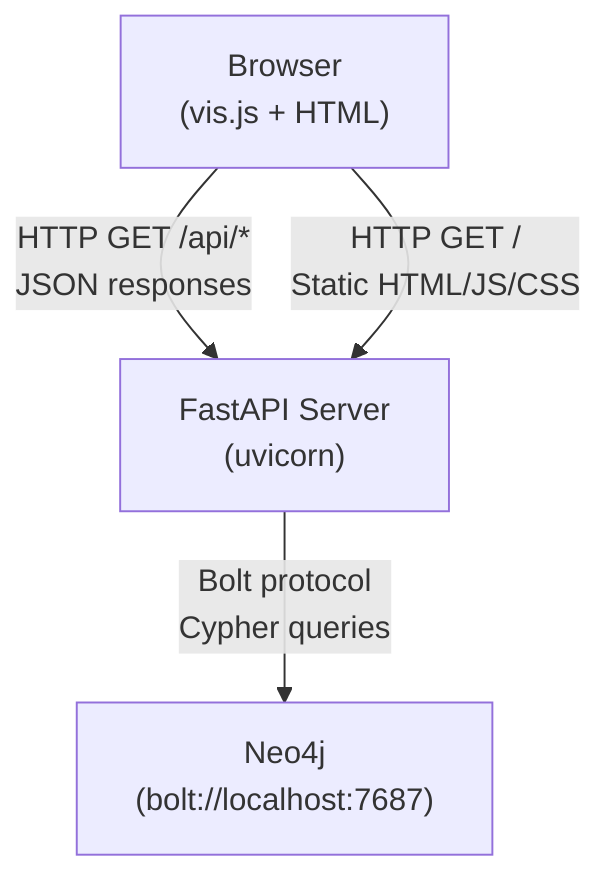
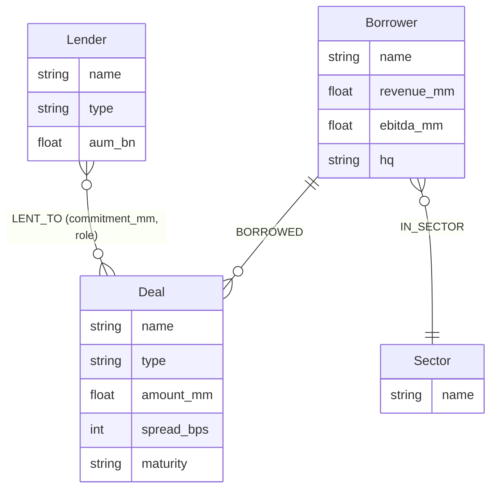
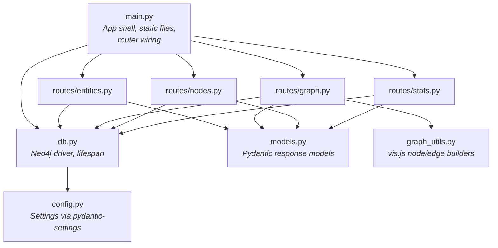
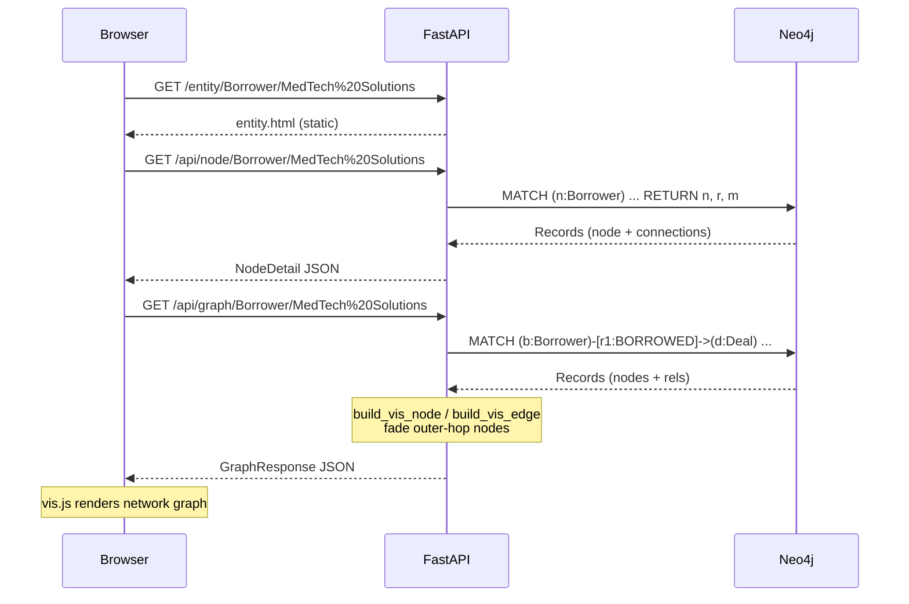

# Direct Lending Graph — Architecture

> Based on the [arc42 template](https://arc42.org/overview). Sections that don't apply to this project are omitted.

---

## 1. Introduction and Goals

### Purpose

Interactive graph visualization of direct lending relationships — borrowers, lenders, deals, and sectors. Built as a demo/prototype for exploring network effects in a lending portfolio.

### Key Requirements

| Priority | Requirement |
|----------|------------|
| Must | Visualize borrower-lender-deal relationships as an interactive graph |
| Must | Drill into any entity to see its properties and connections |
| Must | Show summary statistics across the portfolio |
| Should | Highlight indirect connections (e.g., lenders that share deals with a borrower) |

### Quality Goals

| Goal | Description |
|------|------------|
| Simplicity | Single-server deployment, no build step for frontend |
| Explorable | Swagger/OpenAPI docs auto-generated from typed response models |
| Configurable | Database connection externalized via environment variables |

---

## 2. Constraints

| Constraint | Details |
|-----------|---------|
| Language | Python 3.13 |
| Database | Neo4j (graph database) — chosen because the domain is inherently a network |
| Frontend | vis.js for graph rendering, vanilla HTML/JS (no framework) |
| Deployment | Local development only (no containerization yet) |

---

## 3. Context and Scope

How the system sits in its environment.



| Component | Responsibility |
|-----------|---------------|
| Browser | Renders interactive graph (vis.js), fetches data from API |
| FastAPI Server | Serves static frontend, exposes JSON API, transforms Neo4j results into vis.js format |
| Neo4j | Stores and queries the lending graph |

---

## 4. Building Block View

### Level 1 — Data Model



### Level 2 — Module Structure

```
main.py              App shell, static files, router wiring
config.py            Settings (pydantic-settings, env var overrides)
db.py                Neo4j driver lifecycle
models.py            Pydantic response models (API contract)
graph_utils.py       vis.js node/edge building helpers
routes/
  entities.py        GET /api/entities
  graph.py           GET /api/graph, GET /api/graph/{label}/{name}
  nodes.py           GET /api/node/{label}/{name}
  stats.py           GET /api/stats
static/              Frontend HTML/JS/CSS
seed_data.py         Populates Neo4j with demo data
```



---

## 5. Runtime View

### Scenario: Loading a Borrower's Entity Page



The entity graph query uses a 2-hop pattern: it fetches the target entity's direct deals, then follows one more hop to find other entities sharing those deals. Outer-hop nodes are rendered with reduced opacity to visually distinguish direct from indirect connections.

---

## 6. API Reference

All endpoints return typed Pydantic models. Full schemas are available at `/docs` (Swagger UI) when the server is running.

| Endpoint | Response Model | Description |
|----------|---------------|-------------|
| `GET /api/entities` | `EntityListResponse` | Borrowers and lenders with aggregated stats |
| `GET /api/graph` | `GraphResponse` | Full graph in vis.js format |
| `GET /api/graph/{label}/{name}` | `GraphResponse` | Entity-scoped 2-hop subgraph |
| `GET /api/node/{label}/{name}` | `NodeDetail` | Node properties + all connections |
| `GET /api/stats` | `StatsResponse` | Portfolio-level counts and totals |

---

## 7. Configuration

Settings are managed via `pydantic-settings` and can be overridden with environment variables.

| Variable | Default | Description |
|----------|---------|-------------|
| `NEO4J_URI` | `bolt://localhost:7687` | Neo4j connection URI |
| `NEO4J_USER` | `neo4j` | Neo4j username |
| `NEO4J_PASSWORD` | `demo1234` | Neo4j password |

---

## 8. Decisions

<!-- Record key architectural decisions here as the project evolves.
     See https://adr.github.io/ for the ADR format. -->

| ID | Decision | Rationale |
|----|----------|-----------|
| D1 | Neo4j over relational DB | Domain is a network of lending relationships; graph queries (multi-hop traversals, path finding) are natural in Cypher |
| D2 | vis.js for graph rendering | Mature, well-documented network visualization library; no build step required |
| D3 | Pydantic response models | Self-documenting API via OpenAPI, runtime validation catches schema drift |
| D4 | Full Neo4j nodes in graph endpoints | Graph routes need `.labels` and all properties for vis.js rendering; scalar projections used only where practical (`/api/entities`) |
| D5 | pydantic-settings for config | Standard FastAPI pattern; reads env vars with typed defaults, no extra dependencies beyond Pydantic |

---

## 9. Glossary

| Term | Definition |
|------|-----------|
| Borrower | Company that takes on debt through a deal |
| Lender | Financial institution (BDC or credit fund) that provides capital |
| Deal | A specific lending instrument (term loan, revolver, unitranche, etc.) |
| Sector | Industry classification for a borrower |
| LENT_TO | Relationship from lender to deal, carrying `commitment_mm` (amount) and `role` (Lead Arranger, Participant, Sole Lender) |
| BORROWED | Relationship from borrower to deal (no properties) |
| Outer-hop node | A node discovered via 2-hop traversal, rendered with reduced opacity |
